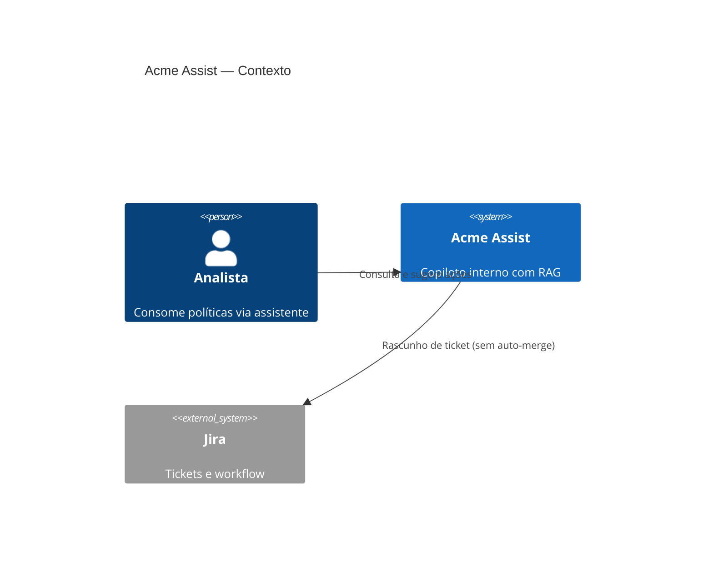
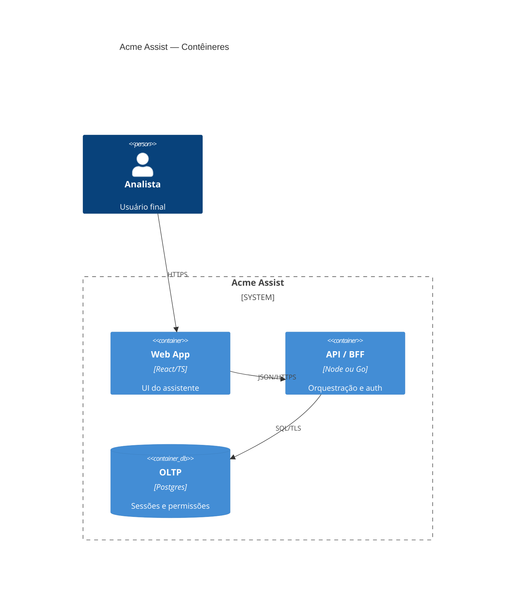
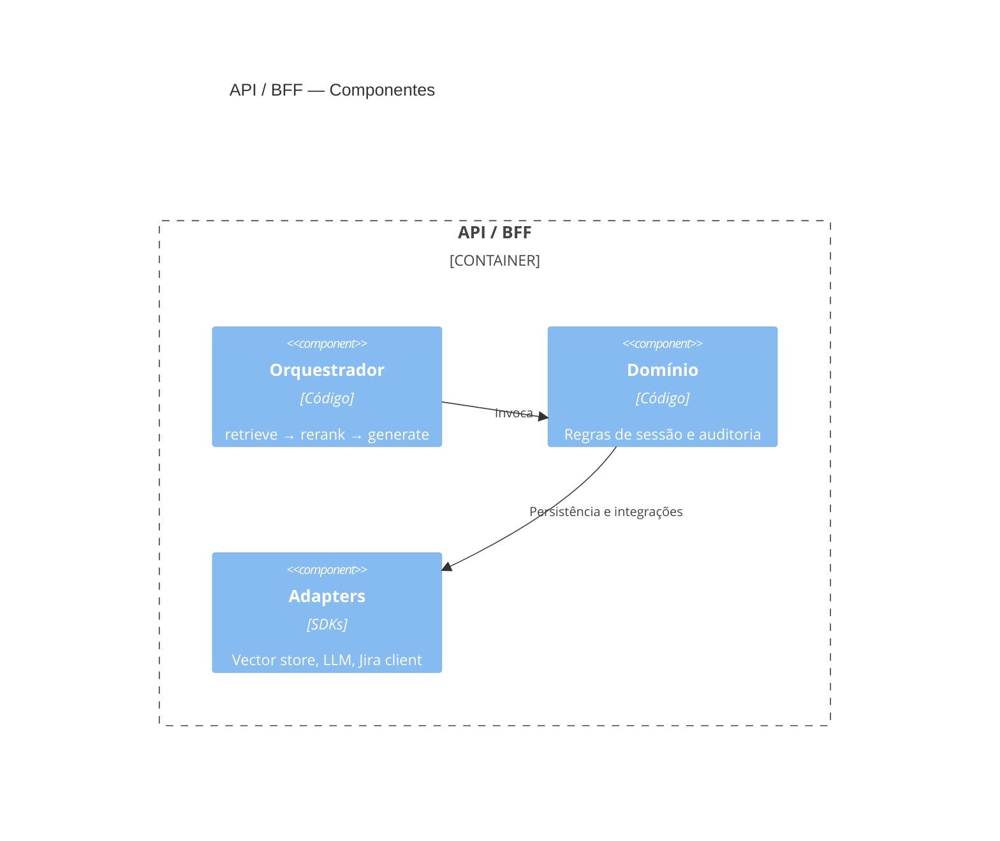

# Exemplo (trecho) — Architecture Brief

> Ilustra **tom** e **profundidade**; não copie como boilerplate genérico. Seções completas devem existir no documento real.

## Visão e contexto

Plataforma **Acme Assist**: copiloto interno para analistas consumirem políticas e runbooks via RAG, com ações sugeridas (sem execução automática de mudanças em produção).

## Stakeholders e personas

- Analista N1/N2 (usuário); Auditoria (leitura de trilhas); SRE (operadores).

## Requisitos funcionais (resumo)

Chat com citações; sugestão de ticket; export de conversa auditável.

## Requisitos não funcionais

- p95 < 3s no caminho RAG com re-ranking; disponibilidade 99.5% MVP.
- Dados de indexação **sem** PII em embeddings; prompts com PII redatados em logs.

## Domínio e fronteiras (bounded contexts)

- **PolicyKnowledge** (ingestão, chunking, permissões por doc).
- **AssistantSession** (sessão, políticas de guardrail).
- **TicketingIntegration** (anticorrupção para Jira).

## Arquitetura lógica e componentes

API BFF → orquestrador de grafo (retrieve → rerank → generate → validate) → vector store + OLTP de sessão.

### C4 — Nível 1: Contexto do sistema (Mermaid)

### C4 — Nível 2: Contêineres (Mermaid)

### C4 — Nível 3: Componentes (Mermaid)

## GenAI: fluxos, dados e avaliação

Golden set por release; métricas: groundedness, latência, % escalação humano; shadow para novos rerankers.

## Segurança, privacidade e conformidade

STRIDE resumido; segregação de tenant; KMS para campos sensíveis; allowlist de tools.

## Operação, observabilidade e SRE

Traces por etapa; SLO de erro de tool; runbook de degradação “só citações, sem geração livre”.

## Estratégia cloud-agnostic e portabilidade

Interfaces `EmbeddingProvider`, `LlmCompletion`, `ObjectStore`, `Queue`; adapters por cloud.

## Riscos, trade-offs e ADRs propostos

### ADR-001 — RAG com re-ranking on-line

- Status: Proposto
- Contexto: Recall insuficiente só com vetor denso.
- Decisão: Re-ranker cross-encoder após top-k vetorial.
- Consequências: +latência e custo de CPU; melhor precisão.

### ADR-002 — Sem auto-execução de mudanças

- Status: Proposto
- Contexto: Risco operacional e auditoria.
- Decisão: Somente rascunho de ticket; humano confirma.
- Consequências: Menor “wow”; maior segurança.

### ADR-003 — Outbox para eventos de auditoria

- Status: Proposto
- Contexto: Consistência entre gravação de sessão e fan-out de auditoria.
- Decisão: Transactional outbox + consumidor dedicado.
- Consequências: Infra adicional; auditoria confiável.

## Roadmap e próximos passos

Onda 1: BFF + RAG read-only. Onda 2: ticketing draft. Onda 3: hardening multi-região.
