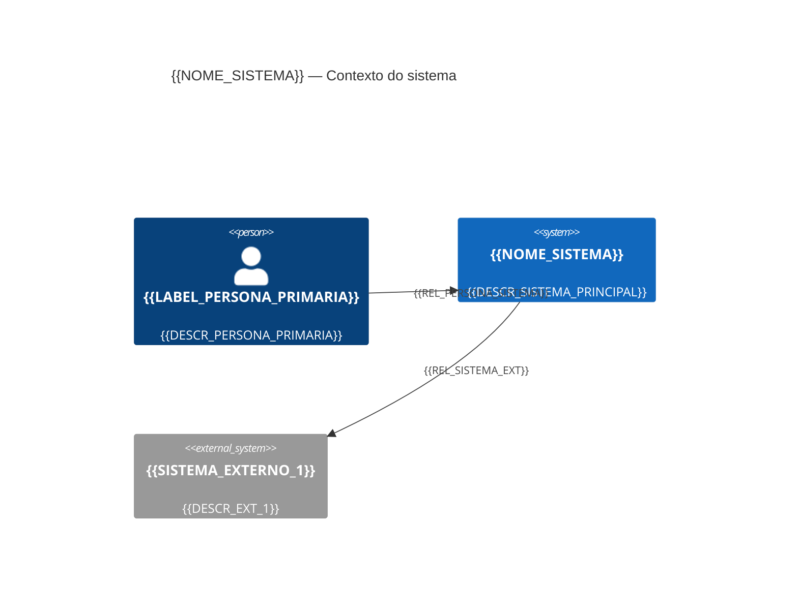
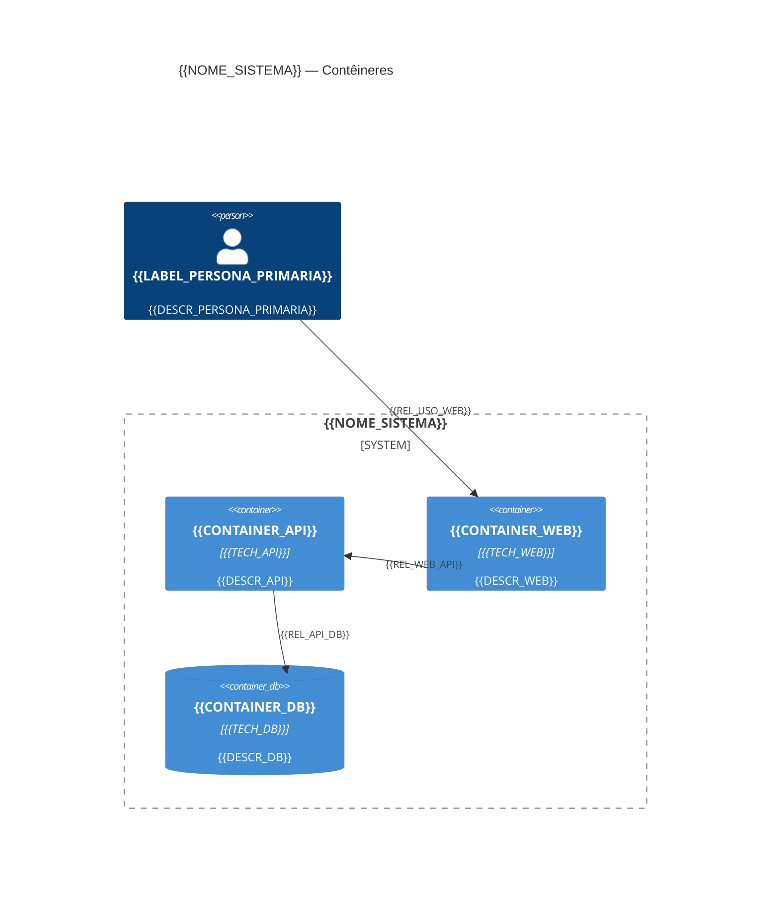
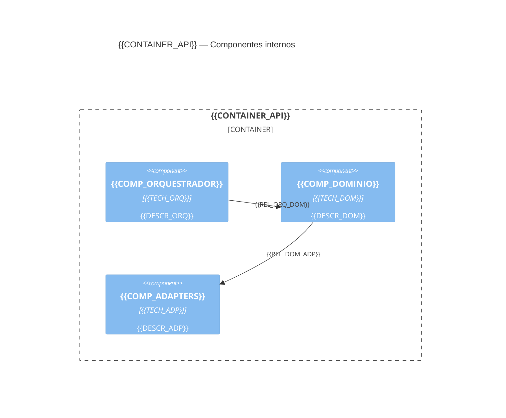

<!--
  TEMPLATE OBRIGATÓRIO — Arquitetura (Markdown → Word/PDF)
  Instruções para o agente:
  1. Copie este arquivo para um novo `.md` (ex.: `arquitetura-<projeto>.md`).
  2. Substitua todos os campos `{{...}}` e o conteúdo dos diagramas Mermaid C4.
  3. Mantenha os títulos `##` exatamente como estão (validador).
  4. Os três blocos `mermaid` com C4Context, C4Container e C4Component são OBRIGATÓRIOS.
  5. Rode `validate_architecture_brief.py` e depois siga `references/export_word_pdf.md` para DOCX/PDF.
-->

# {{TITULO_DOCUMENTO}}

**Versão:** {{VERSAO}} · **Data:** {{DATA_ISO}} · **Autor / time:** {{AUTOR}}  
**Sistema / produto:** {{NOME_SISTEMA}} · **Confidencialidade:** {{CONFIDENCIALIDADE}}

---

## Visão e contexto

{{VISAO_CONTEXTO}}

## Stakeholders e personas

{{STAKEHOLDERS}}

## Requisitos funcionais (resumo)

{{REQ_FUNCIONAIS}}

## Requisitos não funcionais

{{REQ_NAO_FUNCIONAIS}}

## Domínio e fronteiras (bounded contexts)

{{DOMINIO_BOUNDED_CONTEXTS}}

## Arquitetura lógica e componentes

{{DESCRICAO_ARQUITETURA_LOGICA}}

### C4 — Nível 1: Contexto do sistema (obrigatório — Mermaid)

### C4 — Nível 2: Contêineres (obrigatório — Mermaid)

### C4 — Nível 3: Componentes (obrigatório — Mermaid)

{{COMPONENTES_TEXTO_ADICIONAL_OPCIONAL}}

## GenAI: fluxos, dados e avaliação

{{GENAI_FLUXOS_DADOS_AVALIACAO}}

## Segurança, privacidade e conformidade

{{SEGURANCA_PRIVACIDADE}}

## Operação, observabilidade e SRE

{{OPERACAO_OBSERVABILIDADE}}

## Estratégia cloud-agnostic e portabilidade

{{ESTRATEGIA_CLOUD_AGNOSTIC}}

## Riscos, trade-offs e ADRs propostos

{{RISCOS_TRADEOFFS_INTRO}}

### ADR-001 — {{ADR_001_TITULO}}

- Status: {{ADR_001_STATUS}}
- Contexto: {{ADR_001_CONTEXTO}}
- Decisão: {{ADR_001_DECISAO}}
- Consequências: {{ADR_001_CONSEQUENCIAS}}

### ADR-002 — {{ADR_002_TITULO}}

- Status: {{ADR_002_STATUS}}
- Contexto: {{ADR_002_CONTEXTO}}
- Decisão: {{ADR_002_DECISAO}}
- Consequências: {{ADR_002_CONSEQUENCIAS}}

### ADR-003 — {{ADR_003_TITULO}}

- Status: {{ADR_003_STATUS}}
- Contexto: {{ADR_003_CONTEXTO}}
- Decisão: {{ADR_003_DECISAO}}
- Consequências: {{ADR_003_CONSEQUENCIAS}}

{{ADRS_ADICIONAIS_OPCIONAL}}

## Roadmap e próximos passos

{{ROADMAP}}
